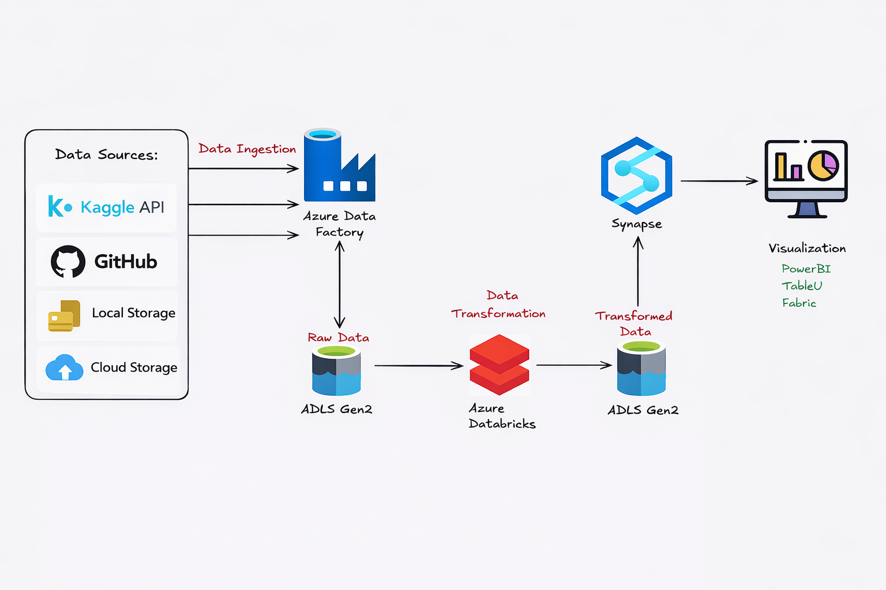

# Tokyo Olympics Data Engineering Project - Azure

A complete end-to-end data engineering pipeline for Tokyo Olympics data using Azure services and Apache Spark for data transformation and analytics.

## 🏗️ System Architecture




## 📊 Project Overview

This project demonstrates a modern data engineering workflow that ingests, transforms, and analyzes Tokyo Olympics data using Microsoft Azure cloud services. The pipeline processes multiple datasets including Athletes, Coaches, Teams, Medals, and Gender Entries data.


The architecture implements:
- **Data Ingestion**: Raw Excel files uploaded to Azure Data Lake Storage (ADLS) Gen2
- **Data Processing**: Azure Databricks with Apache Spark for transformation
- **Data Storage**: Transformed CSV files stored back in ADLS Gen2
- **Analytics**: Schema optimization and data type casting for efficient querying

## 📁 Project Structure

```
Tokyo-Olympics-Azure-End-to-End-Data-Engineering/
│
├── Raw-Olympic_Data_Excel/          # Source data in Excel format
│   ├── Athletes.xlsx
│   ├── Coaches.xlsx
│   ├── EntriesGender.xlsx
│   ├── Medals.xlsx
│   └── Teams.xlsx
│
├── Olympic_Data_CSV/                # Converted CSV files
│   ├── Athletes.csv
│   ├── Coaches.csv
│   ├── EntriesGender.csv
│   ├── Medals.csv
│   └── Teams.csv
│
├── Transformed-Olympic_Data_CSV/    # Processed & transformed data
│   ├── Athelets.csv
│   ├── Coaches.csv
│   ├── GenderEntries.csv
│   ├── Medals.csv
│   └── Teams.csv
│
├── Data_Format_change.ipynb         # Excel to CSV conversion notebook
├── Tokyo Olympics Transformation.ipynb  # Spark transformation notebook
└── sys_architecture.png             # Architecture diagram
```

## 🔧 Technologies Used

- **Cloud Platform**: Microsoft Azure
- **Storage**: Azure Data Lake Storage (ADLS) Gen2
- **Processing**: Azure Databricks
- **Framework**: Apache Spark (PySpark)
- **Language**: Python
- **Libraries**: 
  - `pandas` - Data manipulation
  - `pyspark` - Distributed data processing
  - `openpyxl` - Excel file handling

## 🚀 Features

### Data Transformation Pipeline
1. **Format Conversion**: Excel (`.xlsx`) to CSV conversion
2. **Schema Inference**: Automatic data type detection
3. **Type Casting**: Converting string columns to appropriate types (Integer, Double)
4. **Data Quality**: Header preservation and structured output

### Analytics Capabilities
- Top countries by Gold medals ranking
- Average gender distribution by discipline
- Statistical aggregations and metrics
- Optimized schema for query performance

## 📋 Prerequisites

### Azure Resources
- Azure Account with active subscription
- Azure Data Lake Storage Gen2 account
- Azure Databricks workspace
- Service Principal with appropriate permissions

## 🎯 Getting Started

### 1. Data Preparation
# Converts all .xlsx files in the input folder to .csv

### 2. Azure Configuration
Configure Azure storage credentials in Azure Databricks:
```python
storage_account = "tokyoolympicmeetpatel"
container = "tokyo-olympics-data"

spark.conf.set(f"fs.azure.account.auth.type.{storage_account}.dfs.core.windows.net", "OAuth")
```

### 3. Data Transformation
Execute the `Tokyo Olympics Transformation.ipynb` notebook:
- Load CSV files from ADLS Gen2
- Apply schema transformations
- Cast data types for numeric columns
- Write transformed data back to ADLS Gen2

## 📊 Data Schema

### Athletes
- PersonName, Country, Discipline

### Coaches
- Name, Country, Discipline, Event

### EntriesGender
- Discipline, Female (Integer), Male (Integer), Total (Integer)

### Medals
- Rank, Team/NOC, Gold (Integer), Silver (Integer), Bronze (Integer), Total (Integer)

### Teams
- Name, Discipline, Country, Event

## 📈 Sample Analytics

1. **Gold Medal Rankings**: Identify top-performing countries
2. **Gender Distribution**: Calculate average male/female participation by discipline
3. **Team Analysis**: Cross-reference team compositions with medal counts

## 🔐 Security

- OAuth 2.0 authentication with Azure AD
- Service Principal for programmatic access
- Role-Based Access Control (RBAC) for resource management
- Secrets management via Azure Key Vault (recommended)

## 📝 License

This project is for educational and portfolio demonstration purposes.

## 👤 Author

**Meet Patel**

## 🙏 Acknowledgments

- Tokyo Olympics data source
- Microsoft Azure documentation
- Apache Spark community

## 📞 Contact

For questions or feedback, please open an issue in the repository.

---

**Note**: Update the Azure credentials placeholders (`your-application-client-id`, `your-secret-key`, `your-tenant-id`) with actual values before deploying to it run environment. 